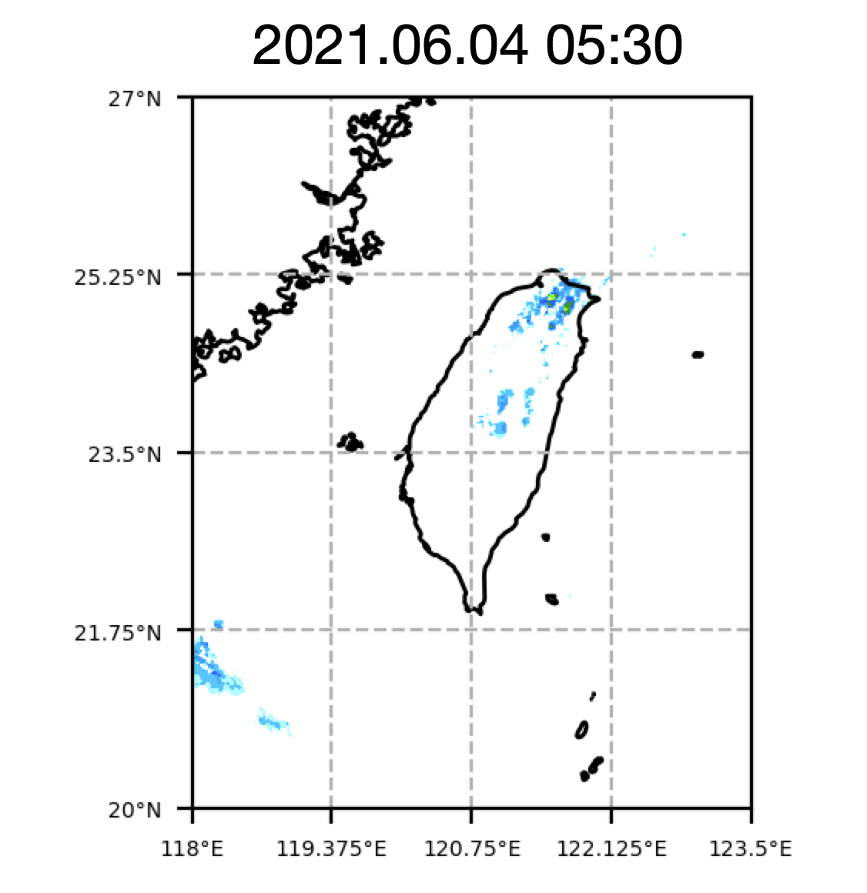
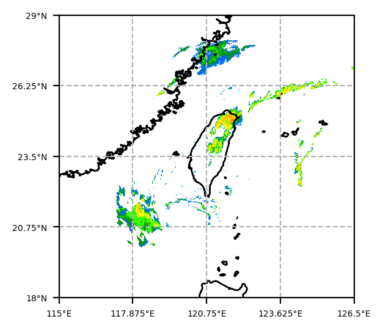
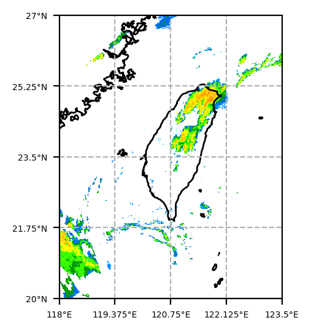

# Description
- This repository helps create the data needed for deepQPF training.
- It has **three** main functions:
  1. [Convert accumulated rainfall (mm) into rain rate (mm/hr)](#1-convert-accumulated-rainfall-mm-into-rain-rate-mmhr)
  2. [Crop the matrix to a target domain](#2-crop-the-matrix-to-a-target-domain)
  3. [Compress data into a sparse matrix](#3-compress-data-into-a-sparse-matrix)
- Last edit date: 2023-04-05

# Environment Settings
1. Recommand to use a virtual environment like conda env
    ```bash
    # update conda in base env
    conda update conda

    # create a new env for this project
    conda create --name deepQPF_preparation python=3.8 -y

    # turn off the auto-activate
    conda config --set auto_activate_base false
    ```
2. Install the required packages
    ```bash
    conda install --yes --channel conda-forge --file requirement_conda.txt

    pip install -r requirement_pypi.txt
    ```

3. Delete the virtual environment
    ```bash
    conda env remove -n deepQPF_preparation
    ```

:bulb: If you find the pip-installed packages are not in the conda env path, namely you connot find the package in `conda list`, then there must something set in `pip.config` or `pip.ini` under your `$HOME`.

# Quick Start
## 1. Convert accumulated rainfall (mm) into rain rate (mm/hr)
```bash
# data path
input_data_path/
├── 2023
│   ├── 202301
│   │   ├── 20230101
│   │   │   ├──20230101_0010.nc
│   │   │   ├──20230101_0020.nc
│   │   │   ...
│   │   ├── 20230102
│   │   ...
│   ...
output_data_path/
├── 2022
│   ├── 202212
│   │   ├── 20221230
│   │   │   ├──20221230_2310.nc
│   │   │   ├──20221230_2320.nc
│   │   │   ...
│   │   ├── 20231231
│   │   ...
│   ...
```
```bash
# cmd:
python main_rain.py \
    <input_data_path> \
    <output_data_path> \
    <variable_name> \
    -c <store_json_path> \
    --type all
```
:warning: This is a rough version adopted from a previous project. Some defects listed beblow:
1. Only **NetCDF** files are suitable.
2. Only **--type all** mode, no **--type last** mode.  
3. Once the date time is not continuous, the cleaver will reset to zero and keep calculating.

### Illustration
Before conversion (hourly accumulated):  
  
After conversion (rain rate per ten minutes):  
<!--  -->


## 2. Crop the matrix to a target domain
```bash
# cmd:
python cropper.py \
    <input_data_path> \
    <output_data_path> \
    --latitude_crop 20 27 \
    --longitude_crop 118 123.5 \
    -k cv
```
### Illustration
Before conversion (large region):  
  
After conversion (small region):  
<!--  -->


## 3. Compress data into a sparse matrix
```bash
# cmd:
python main_compress.py \
    <input_data_path> \
    <output_data_path> \
    --workers 4
```

## 4. Visualization
Please check the `notebook/plot_figure.ipynb`.